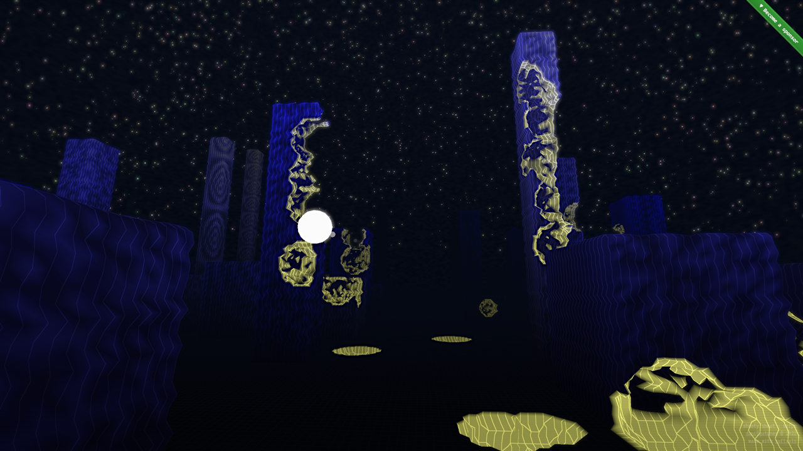

shooty
==

[](https://shooty.gatunes.com/)

### Dev environment

```bash
# clone this repo
git clone https://github.com/danielesteban/shooty.git
cd shooty
# install dev dependencies
npm install
# start the dev environment:
npm start
# open http://localhost:8080/ in your browser
```
